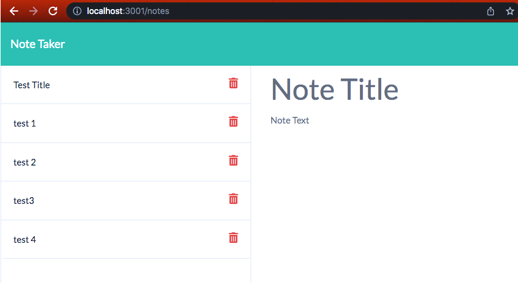
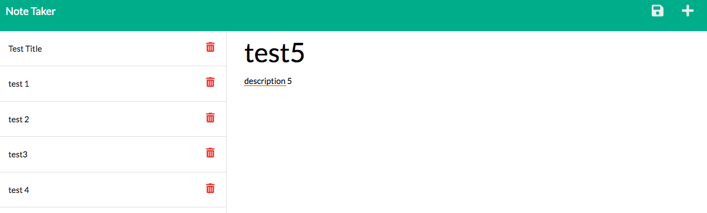

# note-taker

## Description

```
WHEN you open the Note Taker click on the link to the notes page
THEN you will be presented with a page with existing notes listed in the left-hand column, plus empty fields to enter a new note title and the note’s text in the right-hand column
Enter a new note title and the note’s text
Click on the Save icon at the top of the page
THEN the new note you have entered is saved and appears in the left-hand column with the other existing notes
WHEN you click on an existing note in the list in the left-hand column
THEN that note appears in the right-hand column
WHEN you click on the Write icon in the navigation at the top of the page
THEN you will be presented with empty fields to enter a new note title and the note’s text in the right-hand column
```


## Mock-Up

The following images show the web application's appearance and functionality:





- - -
© 2022 Nancy S. All Rights Reserved.
